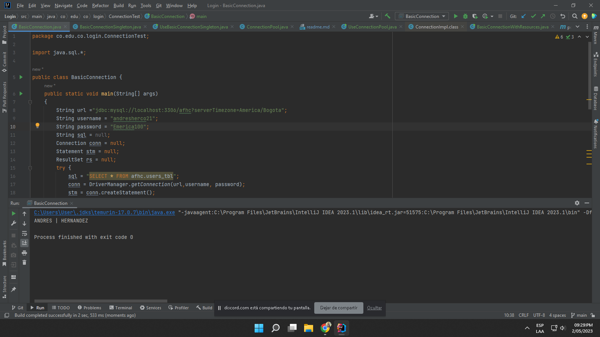

# Proyecto de Inicio de Sesión y Formulario de Registro Conectado a una Tabla 

- Este proyecto consiste en desarrollar un sistema de inicio de sesión y un formulario de registro que estén conectados a una tabla en una base de datos. El objetivo principal es permitir que los usuarios se registren en el sitio web y accedan a sus cuentas a través del inicio de sesión.

## Tecnologías Utilizadas
Para llevar a cabo este proyecto, se utilizarán las siguientes tecnologías:

- HTML
- CSS
- JAVA
- SQL
- PLANETSCALE

## Funcionalidades

El sistema de inicio de sesión y el formulario de registro tendrán las siguientes funcionalidades:

### Formulario de Registro
- El usuario podrá crear una cuenta proporcionando su nombre completo, dirección de correo electrónico y una contraseña segura.
- La contraseña debe cumplir ciertos requisitos, como tener una longitud mínima y contener caracteres especiales.
- Una vez que el usuario haya proporcionado los datos necesarios, se almacenarán en la base de datos.

### Inicio de Sesión
- El usuario podrá iniciar sesión en el sitio web proporcionando su dirección de correo electrónico y contraseña.
- Si el correo electrónico y la contraseña son correctos, el usuario podrá acceder a su cuenta.
- Si el correo electrónico o la contraseña no son correctos, se mostrará un mensaje de error.

### Conexión con la Base de Datos
- Todos los datos proporcionados por los usuarios se almacenarán en una tabla en una base de datos MySQL.
- Se utilizará JAVA para conectarse a la base de datos y realizar las consultas necesarias.

### Conclusiones
Este proyecto es una buena introducción a la programación web, ya que utiliza una variedad de tecnologías populares en el desarrollo de aplicaciones web. Al final del proyecto, el usuario tendrá una comprensión más profunda de cómo se conectan entre sí las diferentes tecnologías utilizadas y cómo pueden utilizarse para crear sistemas de inicio de sesión y formularios de registro en línea.

